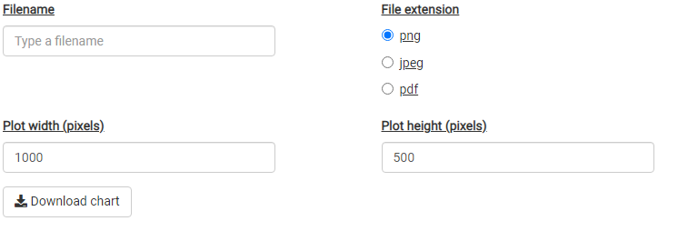

## A Note on Input-Output Modelling

The Economic Impact Assessment Tool (EIAT) allows users to estimate the impact of an investment activity in a region (Local Government Area) in terms of Gross Regional Product (GRP) and full time equivalent (FTE) employment[^1].

[^1]: Note that 1 FTE does not necessarily mean 1 person employed. For example, 2 people who combined work full-time hours (defined by the Australian Bureau of Statistics as 35 hours) would equate to 1 FTE.

Underpinning the EIAT are Input-Output tables for Australia and individual LGAs. Input-Output tables represent how expenditure flows between industries in terms of purchases and sales. They also contain the primary inputs into production such as wages and salaries (the labour input) and other value added. Input-Output tables quantify the structure of an economy. The Australian Bureau of Statistics generates an Input-Output table each year, which describes the Australian economy in terms of 115 industry groups.

Input-Output modelling uses Input-Output tables to quantify the impact of expenditure in one industry based on how that industry makes purchases. For example, in order to build a new road, (a *direct* expenditure) a construction company must purchase goods and services from other construction companies, as well as businesses in other sectors of the economy, which may include chemicals, machinery and equipment, electricity, as well as direct labour. In turn, the businesses who sell their goods and services to the construction company also make their own purchases. A machinery and equipment hire business makes purchases from other industries, and utilises direct labour from their own employees. Employees also spend their labour income on consumable goods such as food and drink, or workwear. These additional purchases (*indirect* expenditures) can be added to the direct effect of the construction project to create an estimate of its total impact.

The flow from a direct expenditure does not continue without limit because input-output tables are leaky. Expenditures which occur outside the economy (ie, those expenditures which are imported) do not contribute.

### Important Assumptions

The use of an input-output model imposes a number of assumptions which must be considered in interpreting the predicted impacts. The most important of these assumptions are:

1.  Increases in demand in the region are serviced by industries with constant proportions, and no significant price adjustments occur.
2.  Industries have a linear production function, which implies constant returns to scale, and fixed input proportions.
3.  Firms within a sector are homogeneous, which implies they produce a fixed set of products that are not produced by any other sector, and that the input structure of all firms are the same.
4.  The model is a static model that does not take into account the dynamic processes involved in the adjustments to an external change.

While private and public stakeholders can use this tool to conduct preliminary Input-Ouput analysis, it is recommended that expert consultants are engaged for a full and detailed report on the estimations of economic impacts, and the interpretations.

## Using the EIAT

Before using the EIAT it is important that the user considers how the investment being analysed interacts with the region in which it will occur. The most important consideration is how much of the expenditure will occur within the region. Any expenditure which occurs outside the region can not be used to estimate either the economic impact in terms of Gross Regional Product, or employment. The tool is not designed to correct for this, and will not provide any warnings or errors if expenditure outside the region is included in the input data. The analyst should therefore have some local knowledge of the economic structure of the region in order to estimate how much could potentially be sourced from within the region.

When this data has been collected, the EIAT can be accessed [here](https://aiti.shinyapps.io/eiat-app/). The landing page provides a description of the tool, a summary of the data used, and the current version of the Regional Input-Output tables. It also reiterates the assumptions present in Input-Output modelling, and the information required to use the tool correctly.

### Setting project parameters

The project parameters can be adjusted by selecting **Project Setup** from the navigation bar at the top of the page. First select the State, and then the Local Government Area of interest.

### Entering data

There are two options to enter data into the tool. For relatively simple analyses the user can first select the number of years into the future over which the investment will continue. It is by default set to 1, and the first year is the current year.

Next, enter the direct capital expenditure for each industry sector into the table. Remember that these expenditures must be in basic (sometimes called producer) prices - that is, they should exclude margins, taxes, and subsidies - and must only be for expenditure which will occur (or is expected to occur) within the region.

If you have a more complex analysis or want to keep a record of the estimated expenditures, a template can be downloaded, based on the parameters set out above, which can be opened in Microsoft Excel, OpenOffice, or Google Sheets. The file can be renamed, but only .csv files will be accepted by the tool. Once the data has been entered into the template, it can be uploaded using the 'Uploaded Data' button.

> Sometimes, something may go wrong. The EIAT expects the file that uploaded file to look like the file previously downloaded. If the uploaded file has too many years of data or does not have appropriate column names, the tool will issue a warning but still upload the data. If the EIAT cannot read the uploaded file, it will show an error and reset the data.

### Economic impacts

Once the direct capital expenditure data have been entered, a summary of the input data can be obtained by selecting the **Input Summary** tab from the navigation panel. Summary tables display the total direct capital expenditure in the region by year, and by industry and year. These tables can be downloaded, copied to clipboard, or printed, by clicking the relevant button.

Summary graphs visualise the input data by year, and by industry and year. These graphs can also be downloaded as .png, .jpeg, and .pdf using the controls shown below the graph.

The estimated economic impacts in terms of employment, and GRP can be seen by selecting the Economic Impacts tab from the navigation panel. For both employment impacts, and GRP impacts, annual and total tables and graphs can be viewed.

The annual impacts table shows the estimated Direct, Flow-on and Total employment or GRP generated through the direct capital expenditure entered into the tool. Each years data can be exported, or viewed as a graph.

> Multiple years can be selected in the annual impacts tables. These tables will now show the Direct or Flow-on values, only the Totals impact for each year of data entered.

The total impacts table shows the total estimated Direct, Flow-on, and Total employment or GRP generated across the entire duration of the investment - i.e. summed over all years.

### Other features

#### Report

A report summarising the economic impact assessment of a project can be automatically generated by selecting **Report** from the navigation panel. The report can be produced as a PDF or Microsoft Word Document, and users can define its content by selecting the tables and graphs to be included.

#### Base Data

The tool includes a 19 sector version of the national input-output table, a summary of employment in the selected region, and the derived 19 sector version of the regional input-output table, for the selected region. These can each be exported to Excel.

## Guided Example

It has been proposed to upgrade an existing road in the South Australian Local Government Area of the **Adelaide Hills**. The road construction is estimated to cost about \$10 million over two years, with some design and surveying to occur in the first year, and the bulk of the construction to occur in the second year.

The economic impact of this project on the Adelaide Hills region can be estimated using the EIAT. To do so, the user must consider how to allocate the \$10 million dollars of expenditure - both across time and across industries.

The user knows the local area well and knows that the road upgrade is relatively simple - there are no tunnels or grade separation. They estimate that about 20% of the total project cost would occur in the design and surveying phase, all occurring in the first year. The user also knows that the design would be carried out by a local firm, but the surveying would be done by a firm from another part of South Australia. An additional \$1 million is estimated to support hiring on site offices and facilities, again from a local firm.

The user also estimates that although construction will begin in 2023, the majority of the construction activity will occur in 2024. They also choose to make an estimate of how much of the construction activity can be sourced from within the Adelaide Hills LGA. Given the size of the project, and local knowledge of the industry, the user makes a conservative estimate that the construction company will need to import about half of all the products and services they require for the project.

As such, the user decides to allocate the direct capital expenditure across three industry sectors.

+-------------------------------------------------+-------------------------+----------------+-------------------------+
| Sector                                          | 2023                    | 2024           | Total                   |
+=================================================+=========================+================+=========================+
| Construction                                    | \$0.35 million          | \$3.15 million | \$3.5 million           |
+-------------------------------------------------+-------------------------+----------------+-------------------------+
| Rental, Hiring and Real Estate Services         | \$0.1 million           | \$0.9 million  | \$1.0 million           |
+-------------------------------------------------+-------------------------+----------------+-------------------------+
| Professional, Scientific and Technical Services | \$1.5 million (Design)  |                | \$1.5 million (Design)  |
|                                                 |                         |                |                         |
|                                                 | \$0 million (Surveying) |                | \$0 million (Surveying) |
+-------------------------------------------------+-------------------------+----------------+-------------------------+

### Results

The Input Summary tab shows how expenditure has been allocated across industries and across years. **Note that although the project is estimated to cost \$10 million, only \$6 million is allocated to the region.**

| Region         | 2023 | 2024 |
|----------------|------|------|
| Adelaide HIlls | 1.95 | 4.05 |

| Sector                                          | 2023 | 2024 |
|-------------------------------------------------|------|------|
| Construction                                    | 0.35 | 3.15 |
| Rental, Hiring and Real Estate Services         | 0.1  | 0.9  |
| Professional, Scientific and Technical Services | 1.5  | 0    |
| Total                                           | 1.95 | 4.05 |

The Economic Impacts tab shows the economic impact of the project. In 2023, the project will generate 7 Full Time Equivalent (FTE) employees as a direct result of the expenditure. An additional 6 FTE will be generated through the Flow-on effects of the expenditure through the economy. Overall, 13 FTE are created in 2023, with the majority (7) occurring in the Professional, Scientific and Technical Services sector. In 2024, 19 FTE are created. In the app, these results can be found in **Economic Impacts \> Employment Impacts \> Annual Impact Results**.

## Technical Matters

### Data sources

The EIAT draws on data from the following sources:

-   The Australian Bureau of Statistics Census 2021

    -   The Census provides information on the number of people who work in a region by industry, and the number of people who work and live in a region by industry.

    -   The data set is accessed through the ABS TableBuilder Pro

    -   2021 Census - counting persons, 15 years and over. INDP Industry of Employment, Local Government Areas (2022 Boundaries) (POW) and Local Government Areas (2022 Boundaries) (UR)

The Australian Bureau of Statistics National Input-Output Table.

-   Australian National Accounts: Input-Output Tables 2019-20 financial year.

-   Table 5. Industry by industry flow table (direct allocation of imports).

-   Last updated: 27/05/2022

-   Next release: 17/03/2023

### Regional Input Output Tables

The Regional Input-Output Tables used in this tool are derived from the 115 sector Input-Output table provided by the Australian Bureau of Statistics. Due to the availability of data at the regional level, this table is aggregated to a 19 ANZSIC sector Input-Output Table for Australia. This table is the basis for the Regional Input-Output Tables.

Broadly, Input-Output modelling is based on direct coefficients - how sales and purchases by an industry relate to the total production of that industry. These direct coefficients are calculated for the Australian Input-Output Table. Location Quotients are used to determine if an industry in a region can be considered as significant as the industry is across Australia. Significant determines whether or not a region is capable of supplying to local industries at the same proportion as the country as a whole. If not, the region supplies proportionally less to local industries. A region never supplies proportionally more than the country as a whole. Regional employment is used to determine whether or not an industry in a region can be considered significant. The Location Quotient is defined as:

$$
LQ_{i,r} = \frac{E_{i,r}}{\sum_i E_{i,r}}/\frac{\sum_r E_{i,r}}{\sum_{i,r} E_{i,r}}
$$

Where $E_{i,r}$ is the FTE employment in region $r$ and industry $i$.

An industry in a region is said to be significant if $LQ_{i,r} \geq 1$.
